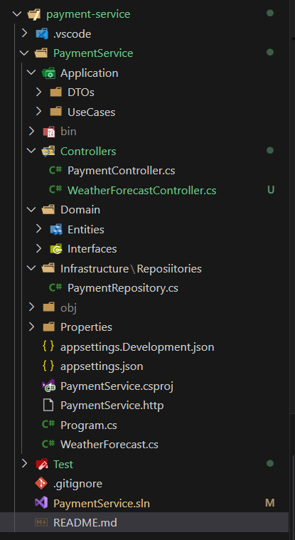

# PaymentService - Microsserviço de Gerenciamento de Pagamentos
Este repositório contém um microsserviço desenvolvido em C# com ASP.NET Core para o gerenciamento de transações financeiras. O serviço permite a criação, consulta e listagem de pagamentos, armazenando os dados em um banco MongoDB. O projeto foi estruturado seguindo os princípios da Arquitetura Limpa (Clean Architecture), com separação clara entre camadas de domínio, aplicação, infraestrutura e apresentação.

## Motivação e Pesquisa Inicial
Este projeto foi criado como um desafio técnico para aprofundar conhecimentos em:

- Desenvolvimento de APIs RESTful com ASP.NET Core
- Uso do MongoDB como banco NoSQL em projetos .NET
- Princípios de Clean Architecture e injeção de dependências
- Manipulação de dados via DTOs e abstração da lógica de negócio em UseCases
- Funcionalidades
Listar todos os pagamentos cadastrados
- Consultar um pagamento específico por ID
- Criar novo pagamento com dados de cliente, valor e data de vencimento
- Status do pagamento gerenciado (pending, paid, failed)

## Estrutura do Projeto
A estrutura do projeto foi organizada em camadas conforme o modelo da Clean Architecture, atendendo à solicitação do desafio técnico de manter uma separação clara entre domínio, aplicação e infraestrutura. Essa organização facilita a manutenção, testabilidade e escalabilidade do código.

## Tecnologias Utilizadas

- C# / .NET 8
- ASP.NET Core Web API
- MongoDB Driver para .NET
- Swagger/OpenAPI para documentação e testes da API

## Configuração e Como Rodar o Projeto

- Pré-requisitos
    - .NET 8 SDK instalado
    - MongoDB rodando localmente ou em um servidor acessível
    - Editor de código (VSCode, Visual Studio, etc.)

## Passos para rodar
    Clone este repositório:
        - Copiar código
        - git clone https://github.com/seuusuario PaymentService.git
        - cd PaymentService
    Configure o MongoDB no arquivo appsettings.json
        {
        "MongoDB": {
            "ConnectionString": "mongodb://localhost:27017",
            "DatabaseName": "PaymentServiceDb"
        }
        }

    Restaure as dependências:
        dotnet restore

    Execute a aplicação:
        dotnet run

- A API estará disponível em https://localhost:{porta}
Use o Swagger UI para testar as rotas automaticamente em:
https://localhost:{porta}/swagger

## Objetivos Realizados
- Implementação de API RESTful para gerenciamento de pagamentos
- Persistência de dados em banco NoSQL MongoDB
- Aplicação dos conceitos de Clean Architecture para manter o código organizado
- Uso de DTOs para separar camadas de domínio e aplicação
- Configuração completa com injeção de dependências e documentação via Swagger
- Funcionalidades básicas: criação, listagem e consulta de pagamentos com status

## Considerações Finais
Este projeto foi uma oportunidade valiosa para eu aprender e aplicar conceitos importantes de desenvolvimento de software, como a arquitetura em camadas (Clean Architecture), uso de DTOs, comunicação com banco de dados NoSQL (MongoDB) e construção de APIs RESTful utilizando ASP.NET Core. Como esta foi minha primeira experiência prática com C# e desenvolvimento backend, enfrentei muitos desafios e precisei estudar bastante para entender os conceitos básicos e as melhores práticas. Apesar de ainda estar em um nível iniciante e o resultado não ser profissional, me esforcei seguindo as orientações do desafio técnico e entregar um código organizado, funcional e que pudesse ser expandido futuramente.Estou consciente de que ainda tenho muito a aprender e esse projeto é um passo inicial no meu caminho de crescimento como desenvolvedora de software. Acredito que com dedicação contínua e prática conseguirei evoluir rapidamente. Agradeço pela oportunidade de desenvolver esse projeto, que certamente ampliou meu conhecimento e me motivou a aprofundar mais no ecossistema .NET e no desenvolvimento de APIs.